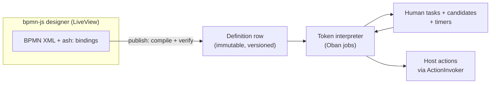
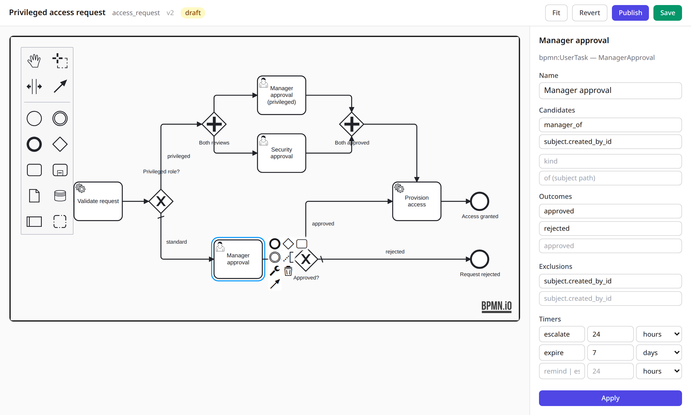
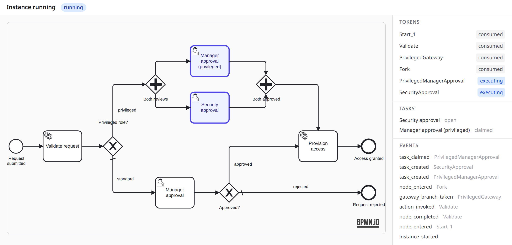
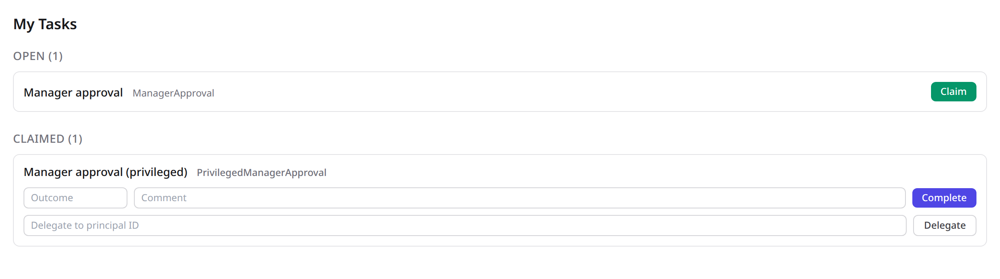

<!--
SPDX-FileCopyrightText: 2026 Luke Galea
SPDX-License-Identifier: MIT
-->

# AshBpmn

**Approvals are the single most requested enterprise workflow pattern, and the Ash
ecosystem has nothing for them.** The request is always the same shape: an action
that requires a second person's approval before it takes effect, with delegation,
escalation, and an audit trail of who approved what. Teams compose it by hand —
`ash_state_machine` for the approval lifecycle, policies for who may approve,
`AshEvents` for the trail — and the composition works, and it is genuinely more
code than the rest of the security model combined.

**AshBpmn makes that composition a dependency** — and then keeps going, to the
process graph, only as far as the evidence supports.

---

## The idea in thirty seconds

There are two products in this package, layered, and the first one is the point:

1. **Approvals as a domain.** Drop `AshBpmn.Changes.RequireApproval` on any action.
   You get the work item (assignee, due date, outcome), the candidate list
   materialized as rows, maker-checker exclusion applied at candidate resolution —
   never as a `forbid_if` — delegation with accountability, remind/escalate/expire
   timers that are Oban jobs and actually get cancelled when the task completes
   early, and a process event log an auditor can read. No diagram required.

2. **Processes as data, designed in BPMN.** When an approval chain outgrows "one
   gate on one action" — routing by amount, parallel reviews, a join — model it in
   the embedded bpmn-js designer. The XML document is the **single artifact**: the
   designer edits it, a compiler verifies it and produces an immutable versioned
   graph snapshot, and a token interpreter executes it over Postgres and Oban.
   Instances pin their definition version for life. In-flight instances never
   depend on a currently-loaded module.

The one-artifact rule is why this can ship a visual designer without shipping the
round-tripping problem that kills visual modellers. There is no code DSL to keep in
sync with the diagram, because the diagram *is* the source. Compilation is one-way,
immutable, and versioned — the same discipline Camunda applies when it deploys BPMN
files rather than pointing the engine at source.



## What it looks like

The designer is bpmn-js embedded in a LiveView, with a server-rendered
properties panel for the `ash:` bindings. Selecting a user task shows the
candidates, outcomes, exclusions and timers that the compiler will read:



The instance viewer renders the version an instance pinned, marks the nodes it
currently holds tokens on, and lists the tokens, tasks and events behind it:



And the task list is the candidate rows, queried:



All three are real screenshots of the demo app in [`dev/`](https://github.com/lukegalea/ash_bpmn/tree/main/dev), which you can
run yourself — see [running the demo](#running-the-demo).

The engine orchestrates and never decides: every node resolves to a host callback,
every mutation runs through ordinary Ash actions with their own policies and
validations. Business logic in the graph is the controller-layer authorization
mistake in a new costume, and AshBpmn's structure makes it hard to commit.

## Show me

An approval on an action — no diagram anywhere:

```elixir
# Your resource. The change is the entire integration.
create :submit do
  accept [:role_id, :justification]
  change AshBpmn.Changes.RequireApproval,
    key: "access_request.grant",
    name: "Approve access request",
    outcomes: [:approved, :rejected],
    candidates: [{:manager_of, "subject.created_by_id"}],   # your resolver interprets these
    excluding: ["subject.created_by_id"],                     # maker-checker, by subtraction
                                                      # at candidate resolution — not
                                                      # a policy forbid_if
    on_complete: %{approved: "provision_access"},    # your invoker runs it after
    escalate_in: [hours: 24],
    expire_in: [days: 7]
end
```

The process event log already shows who claimed, who decided, what they saw, and
which timer fired. `AshBpmn.my_tasks/2` is one indexed query because candidates are
rows, not per-request policy evaluation.

When the chain grows — privileged requests need a security officer too, in parallel
with the manager — draw it:

```xml
<bpmn2:userTask id="ManagerApproval" name="Manager approval">
  <bpmn2:extensionElements>
    <ash:taskConfig>
      <ash:candidates>
        <ash:candidate kind="manager_of" of="subject.created_by_id"/>
      </ash:candidates>
      <ash:exclusions>
        <ash:exclusion who="subject.created_by_id"/>
      </ash:exclusions>
      <ash:outcomes>
        <ash:outcome name="approved"/>
        <ash:outcome name="rejected"/>
      </ash:outcomes>
    </ash:taskConfig>
  </bpmn2:extensionElements>
  ...
</bpmn2:userTask>
```

…edited in the browser, at `/processes/access_request/designer`, published as
version N+1 while version N's instances finish on their own pinned snapshot.

## Assignment is data, and so is the exclusion

The candidate list of a human task is materialized as `TaskCandidate` rows when the
task is created. That single decision buys three things the "just evaluate a policy"
answer cannot:

- **The task list is one query.** Join tasks to candidates on the actor's principal
  ids. No policy evaluation per row.
- **The authorization model stays additive.** Maker-checker is inherently
  subtractive — *except the person who raised it* — and a `forbid_if` is a
  subtraction that breaks order-independence everywhere else. Subtracting while
  *building* the candidate set is data construction, where subtraction belongs.
- **Delegation is a row, not a rule change.** The delegate acts; the delegator is
  accountable (`delegated_from_id`); the event log records both.

Staleness is treated honestly: the rows are an index, the resolver's rule is
re-checked at claim time, and a discrepancy is an event you can see — because a
candidate list that silently disagrees with the role model is a bug you want
 surfaced, not hidden.

## What it executes

The [Common Executable] subset that the 39,695-model corpus study says is what
real processes actually use: start and end events, user and service tasks,
exclusive gateways (with default flows), parallel fork and join. Gateway conditions
are written in **FEEL**, the DMN expression language (`subject.amount > 50000`,
`task.outcome = "approved"`), validated at publish time and stored in the snapshot as source
text. One language serves gateway conditions and DMN decision tables alike, which is why this
package no longer carries an expression language of its own.
Everything else in BPMN's 244 collaboration-relevant elements — call activities,
ad-hoc sub-processes, the event taxonomy, compensation markers — is rejected at
compile time with the element's id in the error, because silently ignoring an
element a business analyst drew is how a diagram and a system quietly become
about different processes.

## Installation

Not yet on Hex. As a git dependency:

```elixir
defp deps do
  [
    {:ash_bpmn, github: "lukegalea/ash_bpmn"}
  ]
end
```

Then:

- instantiate the six resources into one of your domains (the `ash_events` pattern
  — `use AshBpmn.Resources.Definition, domain: ..., repo: ...`),
- point `config :ash_bpmn, assignment_resolver: ...` and `action_invoker: ...` at
  your two callback modules,
- add bpmn-js to your asset bundle and register the designer hook (one import),
- generate migrations.

`mix igniter.install ash_bpmn` does the formatter wiring; see the topics below for
the rest, step by step.

## Running the demo

`dev/` is a small Phoenix application that instantiates the six resources,
implements the two callback modules against a hard-coded org chart, and mounts
the designer, viewer and task list. It is the fastest way to see the whole thing
working, and it is where the screenshots above come from.

```bash
mix deps.get
mix dev.assets   # npm install + esbuild/tailwind into dev/priv/static
mix dev.setup    # create the database, migrate, seed a published process
mix dev.server   # http://localhost:4008
```

The seeds leave three instances behind — one waiting on a manager, one forked
into two parallel reviews, one already completed — so every view has something
real in it. `mix dev.reset` starts over. To regenerate the documentation
screenshots against a running server:

```bash
node dev/screenshots/capture.mjs
```

## Documentation

- [How it works](documentation/topics/how-it-works.md) — one artifact, one-way
  compilation, a token per branch.
- [The designer](documentation/topics/the-designer.md) — embedding bpmn-js, the
  `ash:` extension namespace, the license watermark you must keep.
- [Running processes](documentation/topics/running-processes.md) — the engine:
  workers, timers, joins, the reconciliation sweep, failure semantics.
- [Assignment and maker-checker](documentation/topics/assignment-and-maker-checker.md)
  — candidates as rows, exclusion at resolution, delegation with accountability.
- [Authorization and tenancy](documentation/topics/authorization-and-tenancy.md)
  — the engine's own authority as one named policy, the tenant through jobs, and
  sitting a work item on your base resource.
- [What it refuses](documentation/topics/what-it-refuses.md) — the compile-time
  rejections, and the features deliberately absent.

## Status

0.1.0. The approval layer and the engine are exercised by the test suite against
real Postgres; the designer is exercised through its LiveView contracts and, in
a browser, through the `dev/` app. The reference integration lives in
`ash_enterprise` (privileged access request approval).

Authorization and tenancy are wired rather than declared-and-forgotten: the
engine's own writes go through one named policy bypass instead of ninety
`authorize?: false` options, `:tenant` reaches the rows it names, and a work item
can sit on a host's base resource. See
[authorization and tenancy](documentation/topics/authorization-and-tenancy.md),
which also states the one ordering rule that comes with `:base`.

The assignment resolver is the interface most likely to move on contact with a
real org chart. Both callers now hand it one normalized spec shape — see
[assignment and maker-checker](documentation/topics/assignment-and-maker-checker.md#one-resolver-both-layers)
— so a host writes a single implementation; what may still change is the
vocabulary of clauses that shape carries.

## Contributing

Issues and PRs at [github.com/lukegalea/ash_bpmn](https://github.com/lukegalea/ash_bpmn).
`mix compile --warnings-as-errors` and the test suite must pass; CI runs both
against Postgres 16. Changes to the LiveViews or the designer hook should be
checked in the `dev/` app — the test suite exercises the LiveView contracts, but
only a browser exercises bpmn-js — and the affected screenshots regenerated.

## License

MIT. The embedded designer is [bpmn-js], which carries the bpmn.io licence: keep
the "Powered by bpmn.io" watermark visible and unmodified in rendered diagrams.
That obligation travels with your app, not with this package's MIT text — see
[the designer](documentation/topics/the-designer.md#the-watermark) before you
white-label.

[Common Executable]: https://www.omg.org/spec/BPMN/2.0.2
[bpmn-js]: https://github.com/bpmn-io/bpmn-js
