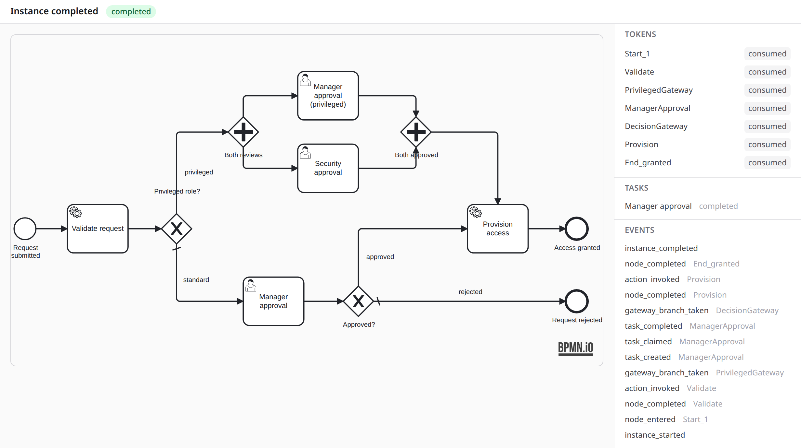

<!--
SPDX-FileCopyrightText: 2026 Luke Galea
SPDX-License-Identifier: MIT
-->

# Running processes

The engine is a token interpreter whose durability comes from Postgres and whose
scheduling comes from Oban. Nothing about a running process lives in memory.

## The advance loop

```elixir
AshBpmn.start_instance!(MyApp.Bpmn,
  process: "access_request",
  subject: request,
  actor: user,
  tenant: org_id
)
```

Starting an instance pins the latest published definition, creates the instance
row with one active token at the start node, and enqueues the first advance job.
From there, every token transition is the same job:

1. **Load and claim.** The job loads token + instance. A token not in `:active`
   state is a redelivery — skip. Claiming flips `:active → :executing` with an
   optimistic update; if another job won, the loser exits `{:ok, :lost_race}`.
   This claim gate is the idempotency anchor for the whole engine.
2. **Read the snapshot.** Node lookup comes from `definition.graph` — never from a
   module. A definition whose source has been replaced still executes.
3. **Execute the node** (dispatch table below).
4. **Write, once.** Consume the token, create the next token(s), append process
   events, and insert the next advance job — all in one transaction, so a crash
   between steps is impossible rather than handled.

### Node dispatch

| Node | Behaviour |
|---|---|
| startEvent | follow outgoing flows |
| serviceTask | call `action_invoker.invoke(action, ctx)`; retry with backoff on error |
| userTask | create `HumanTask` + candidate rows + timers; token parks at `:executing` |
| exclusiveGateway | evaluate outgoing conditions (first match wins), else the declared default; branch taken is recorded as an event |
| parallelGateway (fork) | mint one child token per outgoing flow, sharing a `fork_id` |
| join | see below |
| endEvent | mark instance `:completed` with the end event's configured outcome |

## Joins

A join node waits for all branches named in its `waits_for`. Each arriving token
is consumed and counted; when the count of consumed arrivals for a `fork_id`
reaches the expected arity, one fresh token is minted at the join and the process
continues. All of this happens in one transaction per arrival, so two branches
finishing simultaneously cannot double-fire: the counter arithmetic is the lock.

A dead sibling branch means the join can never fire — the compiler rejects the
mixed-gateway patterns that create this shape, and the reconciliation sweep
reports any join that has been waiting with dead siblings as a stuck condition
(an event an operator can query), because converting a hang into a different
wrong answer via join timeouts is a choice, and it is not this library's default.

## Timers

Human tasks may declare three timers, each an Oban job with `scheduled_at` and its
id recorded on the task row:

- **remind** — records a `:timer_fired` event; your notifier reads the log.
- **escalate** — calls your resolver's optional `escalate/2` callback and records
  the event; typical use: reassign to the assignee's manager.
- **expire** — force-completes the task with outcome `:expired` and advances the
  token so the graph's expiry path (often a rejection route) runs.

When a task completes, the engine cancels its outstanding timer jobs. This
bookkeeping is not optional in either direction: completing without cancelling
produces escalation emails for decided work, and expiring without advancing
produces a zombie token. If you add a completion path in a host extension,
cancel the timers.

## Failure semantics

A service task error propagates the error to Oban, which retries with backoff up
to `max_attempts` (config, default 5). When attempts are exhausted, the worker
marks the instance `:failed`, records an `:action_failed` event naming the node
and reason, and stops retrying. `AshBpmn.retry_instance!/1` reactivates dead
tokens and re-enqueues them — the operator's button after fixing the underlying
problem.

Human tasks never fail the instance by themselves: they wait. Expiry is the
declared alternative to waiting forever, and it is opt-in per task.

## Watching an instance run

`AshBpmn.Web.ViewerLive` renders an instance against the graph it pinned, with
its live tokens marked on the diagram:


Everything on the right is a row in Postgres, not a reconstruction: the token
table is the branch state (`consumed` for the path already taken, `executing`
for the two parallel reviews this instance is waiting on), the task table is the
human work those tokens parked at, and the event list is the audit trail in
reverse order. Nothing here is derived from an in-memory process.

The same view of a finished instance is the audit trail an approver's manager
actually gets asked for:



Every token is `consumed`, and the event list reads end to end: started, routed
at the gateway, task created, claimed, completed, the action invoked, instance
completed. Because the viewer renders the *pinned* version, this is what the
instance executed, not what the process looks like today.

The nodes an instance is currently on are marked with the `ash-bpmn-highlight`
class, styled by `priv/js/ash_bpmn.css` — which the hook imports, so you get it
by importing the hook.

## The reconciliation sweep

`AshBpmn.Runtime.SweepWorker` is a plain Oban worker you may put on a cron
schedule. It finds running instances whose active tokens have no live job —
lost to a deploy, a cancelled queue, a bug — and re-enqueues their advances
(idempotent by the claim gate), and reports stuck joins. The sweep is a safety
net, not the primary driver; the engine is push-based, and the sweep exists so
"stuck instance" is a detected condition rather than a support ticket.

## Testing the engine

`config :ash_bpmn, oban_testing: :inline` swaps the Oban boundary for a
deterministic shim: advance jobs execute synchronously at insert, timers are
stored and never self-fire — tests fire them explicitly via
`AshBpmn.Runtime.Oban.TestJobs.fire!/2`. There is no clock, no polling, and no
sleep in the engine's test suite, and your host tests get the same determinism.

## Cancellation

`AshBpmn.cancel_instance!/1` marks the instance `:cancelled`, kills its active
tokens and cancels open human tasks (with events). It does not compensate
completed work — compensation is a phase-3 concern this library deliberately does
not ship (see [what it refuses](what-it-refuses.md)).
