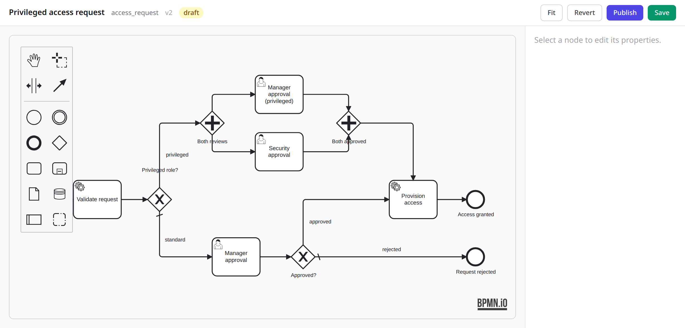
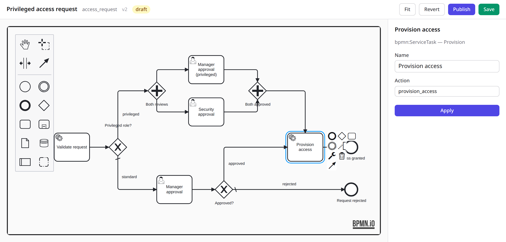

<!--
SPDX-FileCopyrightText: 2026 Luke Galea
SPDX-License-Identifier: MIT
-->

# The designer

The designer is [bpmn-js] — the Camunda-maintained, bpmn.io-licensed modeller that
every embeddable BPMN editor ultimately is — wrapped in a LiveView hook and a
server-rendered properties panel. This page is how to embed it, how the `ash:`
bindings work, and the one licence obligation you cannot skip.



The canvas is bpmn-js. The header is the definition's identity — key, version,
and whether you are looking at a draft or a published version — plus the four
actions: fit, revert to the stored draft, save, and publish. The right-hand
column is the properties panel, empty until something is selected.

Every screenshot on this page comes from the demo app in `dev/`, which is a real
Phoenix application mounting these LiveViews against Postgres. `mix dev.setup &&
mix dev.assets && mix dev.server` runs it; `node dev/screenshots/capture.mjs`
regenerates these images.

## Embedding in a Phoenix app

The hook ships as plain ESM in the package (`priv/js/ash_bpmn_designer.js`), the
same pattern ash_a2ui uses. Your app owns the npm dependency so the designer
shares your bundle's diagram-js instance rather than shipping a second one.

```jsonc
// assets/package.json
{ "dependencies": { "bpmn-js": "^18.0.0" } }
```

```js
// assets/js/app.js
import {AshBpmnDesigner, AshBpmnViewer} from "../../deps/ash_bpmn/priv/js/ash_bpmn_designer.js"

let liveSocket = new LiveSocket("/live", Socket, {
  hooks: {AshBpmnDesigner, AshBpmnViewer}
})
```

The hook imports bpmn-js and its stylesheets itself, plus `ash_bpmn.css` for the
markers the viewer paints on live nodes; esbuild resolves bpmn-js from your
`assets/node_modules`. Because the hook lives in `deps/`, point your bundler's
module resolution at your app: `NODE_PATH=deps:assets/node_modules`, the same
setting a generated Phoenix app already uses. `dev/assets/package.json` in this
repo is a working example. Two LiveViews are wrapped by host modules:

```elixir
defmodule MyAppWeb.Bpmn.DesignerLive do
  use AshBpmn.Web.DesignerLive,
    domain: MyApp.Bpmn,
    process: "access_request",
    actor: {MyAppWeb.Bpmn.Helpers, :current_actor, []},

    # Optional catalogues. Each is an {module, function, args} tuple called as
    # module.function(args ++ [socket]); a failure is swallowed and the panel
    # falls back to free text.
    decisions: {MyAppWeb.Bpmn.Catalogue, :decisions, []},
    actions: {MyAppWeb.Bpmn.Catalogue, :actions, []},
    decision_editor: {MyAppWeb.Bpmn.Catalogue, :decision_editor, []}
end
```

The catalogues are what turn the properties panel from a set of blank text
fields into a set of choices. A decision entry carries the key, its publish
status, and the named decisions inside it; an action entry carries the
`ActionInvoker` ref plus the arguments the host's action actually declares, so
the panel renders one read-only hint and one FEEL input per argument instead of
asking the modeller to spell argument names from memory. `decision_editor`
receives a decision key and the socket and answers with an href (or nil), which
becomes an "Edit decision ↗" link that opens your DMN editor beside the
designer. `AshBpmn.Catalogue.AshActions.entries/1` builds the action catalogue
straight from a list of `{ref, resource, action}` triples; the allowlist is
code, so an entry naming an action that does not exist raises at boot, not in
front of a modeller. No option means today's behaviour: free-text inputs.

The canvas is the client's; the properties panel is the server's. When you select
an element, the hook pushes `selection_changed` — carrying the element's current
`ash:` binding, read out of the modeller — and the LiveView renders the
appropriate form.


For a user task that is candidates, outcomes, exclusions and timers; every list
shows one row per existing entry plus a blank row to add another. The panel is
populated from the canvas rather than from the last-saved XML, and that matters:
edits come back as `apply_config` and the hook rewrites the element's
`extensionElements` from scratch via moddle — never merged, so a panel that
rendered blanks over a configured task would erase it on Apply.

A service task has exactly one required binding plus the typed inputs and
promotions; the panel narrows to those:



## Business rule tasks in the panel

A `businessRuleTask` gets the fullest panel, because it carries the most
vocabulary. With a `decisions` catalogue configured, the decision reference is a
select, the resolved entry shows a status badge (`draft`, or `published vN`), and
a `binding="pinned"` whose version is not the latest published one gets a drift
note saying so — a pin that has quietly fallen behind is exactly the kind of
thing a modeller should not have to discover in the XML. When the key lists more
than one decision, a second select picks which one; with one, there is nothing
to pick. The inputs and promote rows follow the same blank-row convention as a
user task's lists. Every panel field round-trips: the `apply_config` payload
carries the decision elements back out, so Apply rebuilds the element's
`extensionElements` with everything it was shown and erases nothing.

## Typed inputs and promotions on service and send tasks

A `serviceTask` — and a `sendTask`, which is the same node with a different
icon — takes the same declared-inputs and promoted-signals vocabulary a
business rule task has, as siblings of `ash:taskConfig`:

```xml
<bpmn2:serviceTask id="Record" name="Record">
  <bpmn2:extensionElements>
    <ash:taskConfig action="record_risk"/>
    <ash:inputs>
      <ash:input name="risk_tier" from="routing.risk_tier"/>
    </ash:inputs>
    <ash:promote>
      <ash:signal name="granted_role" from="role"/>
    </ash:promote>
  </bpmn2:extensionElements>
</bpmn2:serviceTask>
```

The engine evaluates the inputs with FEEL against the same context a decision
call sees (`subject`, `task`, `routing`, and your `assigns`) and passes the
resulting map to the invoker as `ctx[:inputs]`. When the invoker answers with
`{:ok, map}`, the declared signals are lifted from that map onto the token under
exactly the gating a decision result goes through — scalars only, names and
values bounded — so a gateway further on reads `routing.<signal>` the same way
it reads a decision's promotion. `:ok`, or a non-map result, promotes nothing.
A `sendTask` dispatches through the identical path: it is a service task whose
icon matches what it does.

With an `actions` catalogue configured, the panel renders one row per argument
the host's action actually declares — name, type, a required badge, a tooltip
with the argument's description — and each filled row is persisted as an
ordinary `ash:input` whose name is the argument's name. The catalogue is a
convenience for authoring; the compiler still verifies nothing about it except
that what was written is valid FEEL.

Save asks the hook for `saveXML({format: true})` and stores the document; publish
runs the compiler and, on success, freezes the version.

## The `ash:` namespace

BPMN's extension mechanism is `extensionElements` plus a namespace — the standard
way vendors from Camunda to Flowable attach execution bindings to a diagram.
`ash:` uses it for exactly the things a process needs from Ash:

| Element | On | Carries |
|---|---|---|
| `ash:taskConfig action="..."` | serviceTask, sendTask | the `ActionInvoker` reference |
| `ash:taskConfig` | userTask | candidates, exclusions, outcomes, timers |
| `ash:taskConfig outcome="..."` | endEvent | the instance outcome |
| `ash:decision ref binding name?` | businessRuleTask | the decision reference: `binding` is `latest` or `pinned` (a pin requires `version`); `name` names the decision inside a multi-decision key |
| `ash:inputs` > `ash:input name from` | businessRuleTask, serviceTask, sendTask | a declared FEEL input, evaluated by the engine before the call |
| `ash:promote` > `ash:signal name from? required?` | businessRuleTask, serviceTask, sendTask | a named scalar lifted onto the token's routing; `from` defaults to the signal's own name, `required` defaults to false |
| `ash:outcome name` | userTask config | one allowed decision value |
| `ash:candidate kind="..." of="..."` | userTask config | a resolver clause (opaque to the library) |
| `ash:exclusion who="..."` | userTask config | a maker-checker subtraction |
| `ash:timer kind hours/days/minutes` | userTask config | remind / escalate / expire |

Candidate and exclusion specs are **opaque strings** to ash_bpmn. `kind="manager_of"
of="subject.created_by_id"` means whatever your `AshBpmn.AssignmentResolver` says
it means — the library refuses to know what a manager is, for the same reason it
refuses to know what an approval policy is: both are domain, and domain lives in
the host.

Because bpmn-moddle drops namespaces it has no descriptor for, the hook registers
a moddle descriptor for the full `ash:` vocabulary. The compiler accepts exactly
that vocabulary and nothing more — an unknown `ash:` attribute is a compile error
naming the element, which is typo protection, not pedantry: a designer-typed
`candiates` element that silently vanished would be indistinguishable from an
unassigned task until nobody's task list showed it.

The descriptor declares `xml: { tagAlias: "lowerCase" }`, the same way
camunda-bpmn-moddle does, because the elements are written `<ash:taskConfig>` and
the moddle type is `TaskConfig`. This is not cosmetic: without the alias moddle
reports every `ash:` element as unparsable content and drops it, so the modeller
loads a diagram with no bindings and saves one with the bindings gone — the exact
silent-divergence failure the one-artifact rule exists to prevent. If you fork the
descriptor, keep the alias.

## Versioning and the designer

The designer edits the **draft** row of a definition key. Publish freezes it as a
new version; the designer then starts the next draft from the published XML.
In-flight instances are untouched — they pin the version they started. The
instance viewer renders the pinned version's graph, not the latest draft, which
means what an operator sees is what the instance is actually executing.

## The watermark

bpmn-js is not MIT. It is MIT **plus one clause**: the "Powered by bpmn.io"
watermark that renders on the canvas must not be removed or changed, must stay
fully visible, and must not be overlapped by other elements.

For an internal tool this is a shrug. For a white-labelled product shipped to
enterprise customers it is a procurement conversation. ash_bpmn leaves the
watermark untouched, and so must you — hiding it is a licence violation, not a
styling choice. Plan the bottom-right corner of your canvas accordingly.

[bpmn-js]: https://github.com/bpmn-io/bpmn-js
